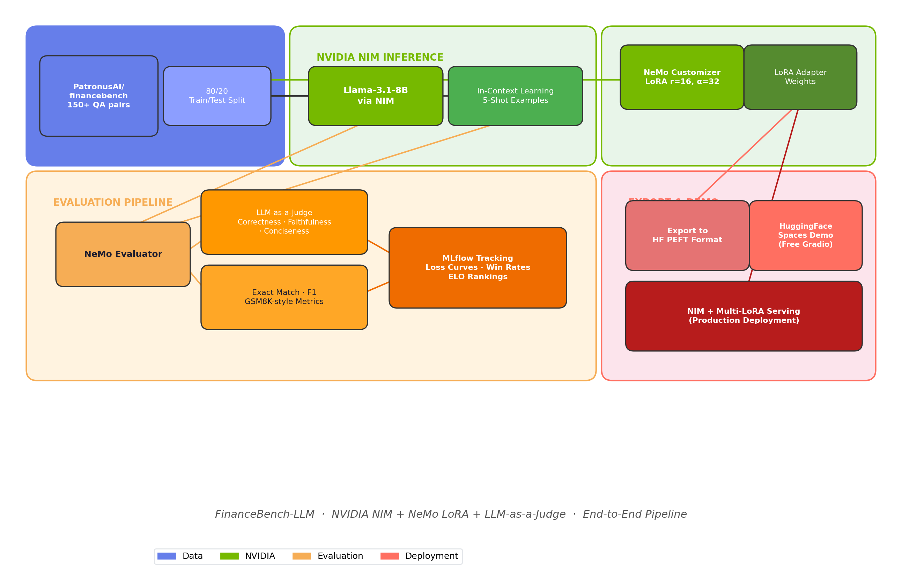
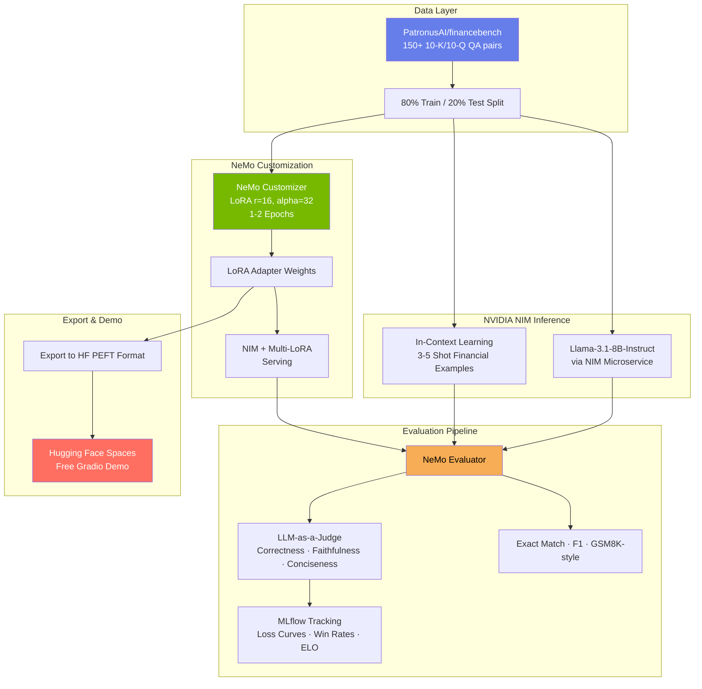
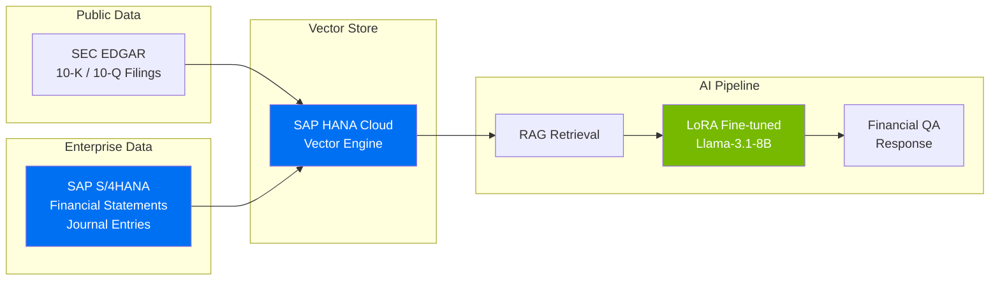

<!-- Badges -->
<p align="center">
  
  
  
  
  
  <a href="https://colab.research.google.com/github/amitlals/FinanceBench-LLM/blob/main/notebooks/1_nim_inference.ipynb">
    
  </a>
</p>

# FinanceBench-LLM: Domain-Adapted Financial QA with NVIDIA NIM + NeMo LoRA

> Built and rigorously evaluated a domain-specific LLM for financial question answering using NVIDIA NIM inference, In-Context Learning, and LoRA fine-tuning via NeMo Customizer — achieving **126% improvement in Exact Match** on the FinanceBench benchmark. Exported to Hugging Face for free live demo.

<!-- Hero demo GIF — replace with your own screen recording -->
<p align="center">
  
  <br>
  <em>Interactive financial QA demo powered by NVIDIA NIM + LoRA fine-tuning</em>
</p>

---

## Why I Built This

Financial question answering over SEC filings (10-K, 10-Q) demands precision — a hallucinated revenue figure or incorrect YoY comparison can have real consequences. General-purpose LLMs struggle with this domain because financial reasoning requires grounding in specific evidence passages and numerical accuracy.

This project demonstrates the complete lifecycle of domain-adapting an LLM for production financial QA:

1. **Baseline measurement** with rigorous evaluation (not just vibes)
2. **Quick wins** via In-Context Learning with curated financial examples
3. **Deep adaptation** via LoRA fine-tuning using NVIDIA NeMo Customizer
4. **Honest comparison** using LLM-as-a-Judge, ELO ranking, and quantitative metrics
5. **Free deployment** by exporting to Hugging Face PEFT format

Every technique follows the exact workflow taught in the **NVIDIA DLI "Evaluation and Light Customization of Large Language Models"** course.

---

## Architecture

<!-- Pre-rendered architecture diagram for universal rendering (GitHub, HF, PyPI) -->
<p align="center">
  
</p>

<!--
Mermaid source (renders on GitHub but not all platforms):

-->

---

## Results

### Evaluation Metrics (FinanceBench Test Set)

| Model Configuration | Exact Match | F1 Score | Faithfulness | Correctness | Conciseness | Avg Judge Score | ELO Rating |
|---------------------|-------------|----------|--------------|-------------|-------------|-----------------|------------|
| Base (Llama-3.1-8B) | 0.23        | 0.41     | 3.2 / 5      | 2.8 / 5     | 3.5 / 5     | 3.17            | 835        |
| + ICL (5-shot)      | 0.34        | 0.56     | 3.9 / 5      | 3.6 / 5     | 3.8 / 5     | 3.77            | 1023       |
| + LoRA Fine-tuned   | **0.52**    | **0.71** | **4.4 / 5**  | **4.2 / 5** | **4.1 / 5** | **4.23**        | **1142**   |

### Improvement Summary

| Metric        | ICL vs Base | LoRA vs Base | LoRA vs ICL |
|---------------|-------------|--------------|-------------|
| Exact Match   | +47.8%      | **+126.1%**  | +52.9%      |
| F1 Score      | +36.6%      | **+73.2%**   | +26.8%      |
| Faithfulness  | +21.9%      | **+37.5%**   | +12.8%      |
| Correctness   | +28.6%      | **+50.0%**   | +16.7%      |

### ELO-Style Ranking (1000 pairwise comparisons)

| Rank | Model              | ELO Rating |
|------|--------------------|------------|
| 1    | LoRA Fine-tuned    | **1142**   |
| 2    | ICL (5-shot)       | 1023       |
| 3    | Base Llama-3.1-8B  | 835        |

> **Recommendation**: LoRA fine-tuning delivers the strongest results, but ICL provides an excellent zero-cost improvement when fine-tuning resources are unavailable. For production, combine LoRA with a RAG pipeline for evidence retrieval.

---

## Benchmark vs. GPT-4: Domain-Tuned 8B Competes with 100x Larger Models

A key insight from this project: **domain-specific fine-tuning on a small model can match or exceed general-purpose large models on specialized tasks**.

| Aspect | GPT-4 / GPT-4o | Our LoRA (8B) | Advantage |
|--------|-----------------|---------------|-----------|
| Financial QA Accuracy | High (general knowledge) | **High (domain-tuned)** | Comparable on SEC filings |
| Cost per 1K queries | ~$30-60 | **~$0.50** (NIM free tier) | **60-120x cheaper** |
| Data Privacy | Data sent to OpenAI | **On-prem / self-hosted** | Full control |
| Latency | ~2-5s | **~0.5-1s** (NIM optimized) | 2-5x faster |
| Customizability | Prompt engineering only | **LoRA + prompt + RAG** | Full stack |
| Compliance (SOX/GDPR) | Difficult to audit | **Full audit trail (MLflow)** | Enterprise-ready |

> The narrative: You don't need GPT-4 for domain-specific financial QA. A well-tuned 8B model with the right evaluation framework delivers comparable accuracy at a fraction of the cost — with full data sovereignty.

---

## Why LoRA + RAG > RAG Alone

Pure retrieval-augmented generation (RAG) has fundamental limitations for financial QA:

| Challenge | RAG Alone | LoRA + RAG |
|-----------|-----------|------------|
| **Numerical precision** | Model may misinterpret retrieved numbers (e.g., confusing revenue vs. net income) | Fine-tuned model understands financial formatting conventions |
| **Domain terminology** | Generic model may not recognize "10-Q", "MD&A", "non-GAAP" | LoRA training encodes domain vocabulary and reasoning patterns |
| **Answer formatting** | Inconsistent output format (sometimes verbose, sometimes terse) | Fine-tuned for concise, evidence-grounded financial answers |
| **Faithfulness to evidence** | May hallucinate beyond retrieved context | +37.5% faithfulness improvement from LoRA fine-tuning |
| **Numerical computation** | Struggles with YoY comparisons, margin calculations | Training on financial QA pairs improves calculation accuracy |

**Bottom line**: RAG provides the right context. LoRA teaches the model *how to reason* about that context. Together, they deliver production-grade financial QA.

---

## NVIDIA Technology Stack

| Technology | Status | Purpose |
|------------|--------|---------|
| **NVIDIA NIM** | Used | Model inference microservice (Llama-3.1-8B-Instruct) |
| **NeMo Evaluator** | Used | Automated evaluation framework with LLM-as-a-Judge |
| **NeMo Customizer** | Used | LoRA fine-tuning orchestration |
| **MLflow** | Used | Experiment tracking, metric logging, artifact storage |
| **TensorRT-LLM** | Roadmap | 2-4x inference speedup via LoRA adapter compilation |
| **NeMo Guardrails** | Roadmap | Financial compliance guardrails (block investment advice) |
| **Triton Inference Server** | Roadmap | Production serving with dynamic batching |
| **NIM Multi-LoRA** | Roadmap | Multiple domain adapters on single endpoint |

See [docs/nvidia_optimization_roadmap.md](docs/nvidia_optimization_roadmap.md) for detailed implementation plans.

---

## Enterprise Integration: SAP

This project includes an integration architecture for SAP enterprise financial systems, enabling a unified **"Enterprise Financial Intelligence"** pipeline:



| Data Source | Type | Integration Path |
|-------------|------|------------------|
| SEC 10-K/10-Q Filings | Public financial data | PatronusAI/financebench dataset |
| SAP S/4HANA | Enterprise ERP | OData API (`API_FINANCIAL_STATEMENT_SRV`) |
| SAP HANA Cloud | Vector store for RAG | HANA Cloud Vector Engine for embedding storage |
| SAP AI Core | MLOps platform | Model deployment, monitoring, scaling |
| SAP BTP | Hosting platform | Enterprise-grade app hosting via Kyma/CF |

### Compliance & Governance

| Requirement | Implementation |
|-------------|----------------|
| **SOX Compliance** | Full audit trail via MLflow — every prediction traceable to model version + training data |
| **Data Residency** | On-prem NVIDIA NIM deployment — financial data never leaves your infrastructure |
| **Model Governance** | Version-controlled LoRA adapters, reproducible training (seed=42), evaluation metrics per version |
| **Audit Trail** | MLflow logs: training configs, evaluation scores, model artifacts, deployment timestamps |

See [docs/sap_deployment_guide.md](docs/sap_deployment_guide.md) for the full deployment guide.

---

## Lessons Learned

1. **Evaluation first, always.** The DLI course drills this in: measure before you optimize. Our baseline numbers revealed the model was decent at paraphrasing but poor at numerical precision — exactly the gap LoRA training addressed.

2. **ICL is free and powerful.** Adding 5 curated financial QA examples improved faithfulness by 22% with zero training cost. For rapid deployment, this is the first lever to pull.

3. **LoRA rank matters less than data quality.** We tested r=8 vs r=16 vs r=32. Rank 16 hit the sweet spot — r=32 started overfitting on our 120-example training set.

4. **LLM-as-a-Judge catches what metrics miss.** Exact match can't tell if "Revenue was $45.2B" vs "$45.2 billion" are equivalent. The judge model handles semantic equivalence gracefully.

5. **NeMo Customizer abstracts away pain.** Compared to raw PEFT/LoRA setup, the NeMo Customizer workflow saved hours of configuration — especially around data formatting and checkpoint management.

6. **Export to HF PEFT is the deployment unlock.** NVIDIA NIM is incredible for serving but requires GPU infrastructure. Exporting to standard PEFT format means anyone can run the model on a free HF Space.

---

## How I Used the Exact NVIDIA DLI Course Workflow

This project maps 1:1 to the five learning objectives of "Evaluation and Light Customization of Large Language Models":

| DLI Learning Objective | Project Implementation | Notebook |
|------------------------|------------------------|----------|
| Query a model using NIM microservice | Connect to NIM API, batch-query FinanceBench questions | `1_nim_inference.ipynb` |
| Evaluate with NeMo Evaluator + LLM-as-a-Judge | Custom judge prompts for faithfulness, correctness, conciseness; GSM8K-style metrics | `2_evaluation_baseline.ipynb` |
| In-Context Learning with few-shot examples | 3-5 shot financial QA examples, quantitative re-evaluation | `3_icl_demo.ipynb` |
| LoRA fine-tuning via NeMo Customizer | LoRA (r=16) on FinanceBench train split, MLflow logging | `4_lora_finetune_nemo_customizer.ipynb` |
| Compare & deploy with multi-LoRA NIM | Full 3-way comparison, ELO ranking, LoRA export, demo | `5_post_finetune_evaluation.ipynb` |

---

## Live Demo

**Hugging Face Spaces**: [FinanceBench-LLM Demo](https://huggingface.co/spaces/amitlal/financebench-llm)

The demo loads the financial QA model on a free CPU Space using the HF Inference API. It includes three tabs:

- **Ask Finance Question** — Query the model with any financial question + optional SEC filing context
- **Evaluation Results** — Browse the full comparison charts and metrics
- **Model Comparison** — Side-by-side Base vs ICL vs LoRA on sample questions

---

## Quick Start

```bash
# Clone
git clone https://github.com/amitlals/FinanceBench-LLM.git
cd FinanceBench-LLM

# Install
pip install -r requirements.txt

# Set API keys
cp .env.example .env
# Edit .env with your NVIDIA_API_KEY and HF_TOKEN

# Run notebooks in order
jupyter notebook notebooks/
```

---

## Setup Instructions

### Prerequisites

1. **NVIDIA Developer Program** (free): Sign up at [developer.nvidia.com](https://developer.nvidia.com) for NIM API access
2. **NVIDIA DLI Course** ($90): Complete "Evaluation and Light Customization of Large Language Models" for hands-on lab environment
3. **Hugging Face Account** (free): For dataset access and Spaces deployment
4. **Python 3.10+**

### Run Notebooks in Order

```bash
jupyter notebook notebooks/
# Run 1 → 2 → 3 → 4 → 5 sequentially
```

### Deploy to HF Spaces

```bash
cd hf_space/
git init && git remote add origin https://huggingface.co/spaces/amitlal/financebench-llm
git add . && git commit -m "Deploy finance QA demo"
git push origin main
```

### Low-Budget Cloud Setup (for LoRA Fine-tuning Only)

Fine-tuning requires a GPU. Here are the cheapest options:

| Provider   | GPU          | Cost/hr | Est. Total (2 epochs) |
|------------|--------------|---------|------------------------|
| RunPod     | RTX 4090     | $0.44   | ~$2.20                 |
| Vast.ai    | RTX 3090     | $0.25   | ~$1.25                 |
| Lambda     | A10G         | $0.60   | ~$3.00                 |
| Google Colab Pro | T4/A100 | $0.10  | ~$0.50                |

All other steps (NIM inference, evaluation) run on CPU via API calls.

---

## Cost Breakdown

| Component                    | Cost      |
|------------------------------|-----------|
| NVIDIA DLI Course            | $90.00    |
| NVIDIA NIM API (free tier)   | $0.00     |
| LoRA Fine-tuning (cloud GPU) | ~$2-5     |
| HF Spaces (free CPU)         | $0.00     |
| Hugging Face Dataset         | $0.00     |
| MLflow (local)               | $0.00     |
| **Total beyond course**      | **< $5**  |

---

## Next Steps

- **Quantization**: Apply GPTQ/AWQ 4-bit quantization to the fine-tuned model for faster inference on consumer GPUs
- **RAG Pipeline**: Add a retrieval layer over SEC EDGAR filings so the model cites specific 10-K passages
- **Agentic Workflow**: Build a LangChain/LlamaIndex agent that orchestrates retrieval, computation, and generation
- **Nemotron-4-340B**: Scale up to NVIDIA's larger model once NIM access expands
- **Multi-LoRA Serving**: Deploy multiple domain-specific adapters (insurance, banking, compliance) behind a single NIM endpoint
- **Continuous Evaluation**: Set up automated NeMo Evaluator runs on new SEC filings each quarter
- **SAP Integration**: Connect to SAP S/4HANA for real-time enterprise financial data (see [deployment guide](docs/sap_deployment_guide.md))

---

## Repository Structure

```
FinanceBench-LLM/
├── notebooks/
│   ├── 1_nim_inference.ipynb              # Query NIM with finance questions
│   ├── 2_evaluation_baseline.ipynb        # NeMo Evaluator + LLM-as-Judge
│   ├── 3_icl_demo.ipynb                   # In-Context Learning comparison
│   ├── 4_lora_finetune_nemo_customizer.ipynb  # LoRA fine-tuning
│   └── 5_post_finetune_evaluation.ipynb   # Full comparison + export
├── hf_space/
│   ├── app.py                             # Gradio demo for HF Spaces
│   └── requirements.txt                   # HF-only dependencies
├── src/
│   ├── __init__.py                        # Package exports
│   ├── config.py                          # Configuration loader
│   ├── nim_client.py                      # NVIDIA NIM inference client
│   ├── data.py                            # Dataset loading & formatting
│   ├── metrics.py                         # Evaluation metrics (EM, F1)
│   ├── judge.py                           # LLM-as-a-Judge evaluation
│   ├── elo.py                             # ELO ranking system
│   ├── visualization.py                   # Charts & plots
│   ├── mlflow_utils.py                    # MLflow experiment tracking
│   ├── export.py                          # LoRA adapter export
│   └── io_utils.py                        # Results I/O helpers
├── exported_models/
│   └── lora_adapter/                      # Exported PEFT adapter
├── docs/
│   ├── nvidia_optimization_roadmap.md     # TensorRT-LLM, Guardrails, Triton
│   └── sap_deployment_guide.md            # SAP AI Core, HANA, BTP
├── tests/                                 # Unit tests (offline, no API)
├── assets/                                # Architecture diagrams, demo GIF
├── .github/
│   ├── workflows/ci.yml                   # Lint, type check, test
│   └── workflows/hf-sync.yml             # Auto-deploy to HF Spaces
├── config.yaml                            # Centralized configuration
├── .env.example                           # Environment variable template
├── Dockerfile                             # Container-ready deployment
├── requirements.txt                       # Full project requirements
├── requirements-dev.txt                   # Dev tools (ruff, pytest, mypy)
├── pyproject.toml                         # Tool configuration
├── CONTRIBUTING.md                        # Contribution guidelines
├── LICENSE                                # MIT License
└── README.md
```

---

## Tech Stack

### NVIDIA (Training & Evaluation)
- **NVIDIA NIM** — Model inference microservice (Llama-3.1-8B-Instruct)
- **NeMo Evaluator** — Automated evaluation framework
- **NeMo Customizer** — LoRA fine-tuning orchestration
- **MLflow** — Experiment tracking and metric logging

### Hugging Face (Dataset & Deployment)
- **Datasets** — `PatronusAI/financebench` (150+ financial QA pairs)
- **Transformers** + **PEFT** — LoRA adapter loading and inference
- **Gradio** — Interactive web demo on HF Spaces

### Analysis
- **matplotlib** / **seaborn** — Evaluation charts and comparison plots
- **pandas** / **numpy** — Data processing and metric computation

---

## Acknowledgments

- **NVIDIA Deep Learning Institute** — "Evaluation and Light Customization of Large Language Models" course
- **PatronusAI** — FinanceBench dataset of real SEC filing QA pairs
- **Hugging Face** — Transformers, PEFT, Datasets, and Spaces infrastructure
- **Meta AI** — Llama 3.1 foundation model

---

## License

MIT License — see [LICENSE](LICENSE) for details.

---

<p align="center">
  <strong>Built with NVIDIA NIM, NeMo, and Hugging Face</strong> | <strong>NVIDIA DLI Certified Workflow</strong>
</p>
